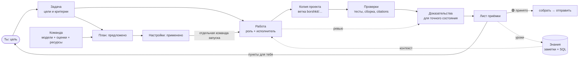

# Документация Borshkit

Начни с [быстрого старта](guide/quickstart.md). Если встретишь непонятное слово — оно есть в [словаре](concepts/glossary.md).

[Настрой команду](guide/setup.md), затем используй [операционное руководство](guide/team-operations.md): компетенции моделей, WIP и бюджет, зависимости, passkey с телефона, монитор, Gemini/VS Code и перенос. [Контроль реализации](discussions/modernization-2026-10-09.md) отделяет исходники, испытания и выпуск.

## Как всё связано

## Руководство

| Документ | О чём |
|---|---|
| [Быстрый старт](guide/quickstart.md) | от установки до первой принятой задачи |
| [Мастер настройки](guide/setup.md) | среда, безопасность, модели, роли и предложение; диалог или приложение |

## Понятия

| Документ | О чём |
|---|---|
| [Словарь](concepts/glossary.md) | одно слово — одно значение |
| [Доказательства и устаревание](concepts/evidence.md) | почему «тесты прошли» ничего не значит без состояния |
| [Приёмка по целям](concepts/acceptance.md) | `auto`, `model`, `manual`, лист приёмки, цели доверия |
| [Исполнители, пулы и автопилот](concepts/executors.md) | кто работает, что при лимитах, когда Borshkit останавливается |
| [Borshkit как профессиональная команда](concepts/team-workspace.md) | консолидированная архитектура, среды, специализация моделей, устройства и открытые этапы |
| [Роли и навыки](concepts/roles-and-skills.md) | 21 роль и пакеты навыков, включая фронтенд и iOS |
| [Приватность и настройки](concepts/privacy.md) | три режима и почему настройки меняются только через предложения |
| [Пространство и Git](concepts/space.md) | папка `borshkit/` и Git простыми словами |
| [База знаний](concepts/knowledge.md) | заметки со связями, SQL, уроки — и формат этой документации |
| [Исследования](concepts/research.md) | источники, дословные цитаты, проверка `citations` |

## Справка

| Документ | О чём |
|---|---|
| [Все команды](reference/commands.md) | русские и английские имена команд |
| [Команда и ресурсы](reference/team-resources.md) | план, оценки ролей, остатки, сроки и применение |
| [Формат задачи](reference/contract.md) | поля `contract.json` и встроенные проверки |
| [Библиотека](../library/README.md) | пакеты навыков и 63 проверенные ссылки для фронтенда и дизайна |
| [Рецепт](ingredients.md) | из чего сварен Borshkit, лицензии и благодарности |
| [Граф документации](graph/README.md) | эта документация глазами самого Borshkit + SQL |

## История решений

- [Аудит и модернизация 2026-10-08](discussions/modernization-2026-10-08.md) — обратная связь, разрывы реализации, источники и этапы перехода к профессиональной команде.

- [Спецификация](spec.md) — исходный анализ, решения владельца D1–D22, архитектура, план оценки. Проектный документ: в нём видно, почему всё устроено так.
- [Ответ на независимый аудит 0.10.1](discussions/audit-2026-10-07.md) — 13 найденных проблем, что исправлено и какими тестами это закреплено.
- [Открытый вопрос о резервной копии](discussions/space-history-backup.md) — черновик обсуждения.

## Как устроена эта документация

Каждая страница — заметка в формате Borshkit: сверху frontmatter с `bk-type` и связями (GitHub показывает его таблицей), внизу раздел «Связи» с обычными ссылками. Поэтому одни и те же файлы:
- читаются на GitHub как обычный Markdown;
- открываются в Obsidian как граф;
- собираются Borshkit в SQL ([граф](graph/README.md)).

Подробнее — в заметке [База знаний](concepts/knowledge.md).
