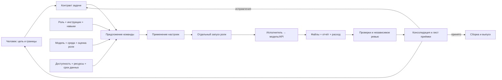

# Borshkit как профессиональная команда

Цель продукта — дать человеку понятную команду ИИ-разработчиков в его проекте: видны обязанности, исполнители, модели, ресурсы, результаты и решения, которые ждут человека. Основные входы — приложения, CLI и IDE Codex и Claude Code. Borshkit хранит общий процесс и доказательства; среда предоставляет диалог, инструменты, авторизацию и удалённое подключение.

Это консолидированная архитектура по обратной связи. Действующая реализация и её ограничения описаны в [операционном руководстве](../guide/team-operations.md) и [контроле модернизации](../discussions/modernization-2026-10-09.md). Формулировка требования не означает, что возможность уже работает.

## Общий процесс

`Предложено`, `применено`, `запущено`, `выполнено`, `проверено` и `принято` — разные факты. Наличие пула не запускает агента. Завершение работы не принимает задачу. Подключённый сервис не доказывает качество модели. Подписка на приложение не гарантирует оплаченный API.

## Обязанности команды

| Обязанность | Существующая роль / владелец | Обязательный результат |
|---|---|---|
| Цель, бюджет, разрешения и приёмка | человек | согласованный контракт и решения |
| Архитектура и техническое задание | `architect` | цели, критерии, проверки, ограничения |
| Распределение ресурсов | `configurator` и детерминированный планировщик | объяснимое предложение настроек |
| Исследование | `researcher` | источники, дата, ограничения выводов |
| Реализация | `implementer`, `ui-engineer` | изменения в копии задачи |
| Проверка | `tester` | воспроизводимые проверки и логи |
| Независимое ревью | `reviewer`, специальные ревьюеры | замечания к конкретному состоянию |
| UX, доступность и движения | `designer`, `flow-auditor`, `a11y-reviewer`, `motion-reviewer` | проверяемые выводы о сценарии |
| Промпт визуального дизайна | `design-prompter` | Markdown-задание в границах задачи |
| Изображение | `readme-designer` | файл и происхождение генерации |
| Документация | `docs-writer`, `attribution-steward` | документация поведения, лицензии |
| Консолидация, инфраструктура, безопасность | `coordinator`, `platform-engineer`, `security-reviewer` и владелец | зависимости, среда и независимые доказательства; решение о выпуске — владелец |

Роли координатора, платформы и безопасности реализованы отдельными инструкциями и схемами; автоматически они не запускаются. Роль не является названием модели. Один исполнитель может подходить нескольким ролям после отдельных оценок, но не может независимо ревьюить собственное семейство авторов.

## Как выбирать модель

Сначала проверяются требования роли, полномочия, политика данных и доступность. Затем — актуальная оценка именно сочетания модели, конфигурации, инструкций, навыков и схемы результата. После этого проверяются ресурсы и резерв для ревью. Сравнение цены и качества допустимо только для сопоставимых измерений на одинаковых заданиях.

| Работа | Кандидаты из пользовательского контекста | Что надо проверить |
|---|---|---|
| Визуальная генерация | GPT Image через поддерживающую среду/API; Gemini image / Nano Banana | генерацию файлов, качество, ограничения API и стоимость |
| Промпт дизайна | доступная Llama Instruct, затем другие текстовые модели | соблюдение задания, полноту ограничений и качество передачи дизайнеру |
| Инструкции и ТЗ | текстовая модель, прошедшая оценку `architect` | проверяемые критерии, отсутствие противоречий, пригодность схемы |
| Изменения кода | CLI-агент либо API с проверяемыми `writes` | инструменты, границы записи, качество и тесты |
| Ревью | другая семья моделей | независимость от всех авторов, включая незавершённые попытки |

«Imagine» в обсуждении трактуется как намерение использовать генерацию изображений ChatGPT, а не закреплённый API ID. Названия Nano Banana и Llama обозначают семейства кандидатов: версию и endpoint выбирают при подключении. Доказательств, что Llama универсально лучше пишет промпты, нет. Её предпочтение проверяется на проектном наборе заданий. UX-анализ, изображение и реализация интерфейса требуют разных оценок.

Текущая оценка роли импортируется человеком из локального материала. Borshkit проверяет срок, отпечатки и доступность материала; он не утверждает, что провёл живой benchmark или удостоверил автора отчёта. Такая оценка не является доказательством приёмки задачи. Стенд `assessment run` исполняет явный набор с независимыми проверками; квалификация по его отчёту применяется отдельно. Результат относится к выбранным заданиям, а не к универсальному рейтингу.

## Ограниченные ресурсы

Токены, запросы, изображения, деньги, контекст и память устройства учитываются раздельно. В наблюдении есть единица, окно, источник, время, срок и область: аккаунт или конкретный endpoint. Общий лимит явно связывается через `quotaGroup`. Ответ `/models` не говорит об остатке генераций. Истёкший остаток становится неизвестным; из расхода нельзя восстановить реальный баланс аккаунта.

Известный ноль исключает кандидата. Неизвестный остаток допускает планирование с предупреждением и возможной остановкой при запуске; достаточный бюджет этим не доказан. Текущий планировщик предпочитает свежие сведения, затем стабильный порядок имён. Он пока не оптимизирует стоимость, не прогнозирует расход и не обходит ограничения подписки.

Если Claude исчерпал лимит, часть работ можно передать квалифицированному кандидату из того же пула. Пишущие кандидаты и их резервные исполнители не должны занять семейство, оставленное для ревью. Если третьего семейства нет после участия Claude и Codex в авторстве, независимое ревью блокируется. Итог и незавершённые изменения сохраняются для человека.

## Консолидация и документация

Профессиональная команда ведёт компактные версионируемые артефакты вместо бесконечной истории чата:

1. До работы — цель, границы, критерии, выбранная команда, бюджет и неизвестные требования.
2. После попытки — изменения, использованная модель, расход, проблемы, сохранённая передача следующему исполнителю.
3. На уровне задачи — проверки на точном состоянии, независимое ревью и лист приёмки.
4. На уровне интеграции — совместимость задач, конфликты, регрессии, согласованные решения.
5. Перед выпуском — актуальные инструкции установки, README, схемы, changelog, состав архива и ограничения поддержки.

В 0.12.0 реализованы артефакты работы и задачи, каталог и предложения команды, зависимости задач с проверкой циклов, общий предел WIP и checkpoints консолидации в JSON и Markdown ([операционное руководство](../guide/team-operations.md)). Checkpoint — снимок состояния, а не слияние и не общая приёмка проекта. Автоматической приёмки, слияния и выпуска нет: решение о выпуске остаётся за владельцем. Документация должна объяснять, что изменилось, чем это подтверждено и что ещё должен решить человек.

## Входы, инструкции и плагины

| Среда | Роль в архитектуре | Поддержка Borshkit сейчас |
|---|---|---|
| Claude Code CLI / IDE | диалог и инструменты; собственные плагины и хуки | плагин Claude Code и CLI-адаптер |
| Codex CLI | агент с sandbox и структурированным выводом | CLI-адаптер; инструкции проекта |
| Приложения Codex и Claude | управление с устройства, возможности среды | обращение к CLI через доступные инструменты среды; отдельный плагин приложения не заявлен |
| Gemini CLI / API | ограниченный CLI и generateContent | модель, JSON/PNG, usage; deny-all CLI профиль и sandbox |
| VS Code | локальный VSIX | команды setup/status/team через Node без shell-интерполяции |
| Copilot, Roo Code, Cline | инструкции среды | managed export; нативные executor adapters и Remote Control не заявлены |
| OpenAI-compatible API | текстовые ответы, `writes`, изображения при поддержке endpoint | существующий API-адаптер; совместимость проверяется отдельно |

Инструкции проекта описывают общие правила. Навык содержит применимый рабочий процесс и загружаемые материалы. Плагин связывает среду с навыками, командами и хуками. MCP обеспечивает обмен инструментами и ресурсами, ACP — контракт общения клиента с агентом; ни один протокол сам по себе не создаёт sandbox и человеческое согласие. MCP Apps — дополнительный интерфейс только для поддерживающего клиента. Протоколы и их версии должны согласовываться адаптером, а не объявляться обязательными для всех устройств.

Голос преобразуется в текст средствами основной среды. Хранить аудио и строить собственный ASR-сервис для базового сценария не требуется. Текст, файлы, изображения, ссылки, события и результаты инструментов должны иметь источник и границы доверия. Внешний материал не получает права менять настройки; надпись «это данные» в промпте сама по себе не защищает от prompt injection.

## Устройства и упаковка

Разделяются устройство управления, устройство исполнения и устройство просмотра результата. Телефон может управлять доступной удалённой средой и читать отчёт; для выполнения нужны поддерживаемые Node.js, Git, CLI/API и работающий компьютер/сервер. Распаковка архива сама по себе не означает возможность запустить локальную модель на любом устройстве.

Текущее ядро — ESM на Node.js 22+, без зависимостей времени выполнения, с `node:sqlite`. CI настроен на Linux, Windows и macOS; поддержка точной версии определяется результатами матрицы. Телефонное локальное исполнение не подтверждено. Архив `borshkit.tgz` устанавливается через npm; плагин Claude Code — отдельный способ подключения той же логики. Есть `Dockerfile` и Dev Container с Node.js 22, локальное расширение VS Code (VSIX), контрольные суммы и релизный workflow с GitHub attestation. Подписанное происхождение есть только у выпуска, для которого этот workflow успешно завершился; локальная контрольная сумма — не подпись. Нативных установщиков нет. Мастер настройки доступен в CLI и пошаговыми командами через приложение.

Воспроизводимость означает закрепить версию пакета, инструкции и навыки, конфигурацию модели, контракт, материалы и проверки; воспроизвести процедуру и проверить результат. Идентичный текст или изображение от недетерминированной модели не гарантируется. Секреты и OAuth-состояние не переносятся в архиве. Перенос результатов не должен сохранять чужие абсолютные пути worktree или старый статус доступности машины.

## Инициализация и мониторинг

Сейчас `начать` создаёт пространство с выключенным автопилотом, пустыми исполнителями и `TEAM.md`. Просмотр команды актуализирует локальную картину; явная проверка подключения и ответы API обновляют наблюдения. `статус --следить` обновляет представления, пока работает CLI. Автоматические API-запросы для поиска моделей и скрытые фоновые задания не запускаются.

Мастер показывает безопасность, основную среду, точные модели, обязанности и сведения, которых не хватает для готовности. Выбор сохраняется отдельно от настроек; поиск файлов известных CLI не исполняет программы или API-запросы. Есть диалог в терминале и команды без TTY из приложения. Предложение связано с выбором, исходными настройками и инструкциями ролей. Оно не создаёт непроверенные пулы и не запускает работы. Стенд оценки и общий бюджет запускаются отдельными командами; пробную задачу мастер не запускает. [Руководство мастера](../guide/setup.md).

Автообнаружение только собирает сведения и предлагает варианты. Сначала предложение, затем разрешение, применение, отдельный запуск. Монитор запускается только явно: `монитор` с start/stop/status, блокировкой процесса, heartbeat и пределом циклов. Он читает локальные наблюдения и создаёт предложения, но не применяет настройки и не запускает работы. Событие и состояние различаются; тишина не доказывает зависание. CloudEvents может дать формат события, но не гарантирует доставку ровно один раз.

## Удалённое подтверждение

Используются штатные Remote Control/remote connections конкретной среды. Их возможности и требование работающего локального процесса различаются; доступ приложения не равнозначен доступу CLI. Для настроек и критических вопросов реализовано подтверждение passkey после доверенного сопряжения устройства: точное действие и ревизия, origin/RP, UV/UP, expiry, одноразовость, отзыв и внешний аудит. [Подключение и границы](../guide/team-operations.md). Первоначальное сопряжение требует доверенного администратора; Git merge/push и сверка бюджета остаются терминальными.

Произвольный JSON, `--yes`, голосовое сообщение или TTY сами по себе не доказывают личность. Реестр и сервис должны быть недоступны агенту для записи. Это протокол согласия, не защита от владельца ОС.

## Связи

- [Практические команды и форматы](../reference/team-resources.md)
- [Аудит и этапы модернизации](../discussions/modernization-2026-10-08.md)
- [Исполнители](executors.md)
- [Роли и навыки](roles-and-skills.md)
