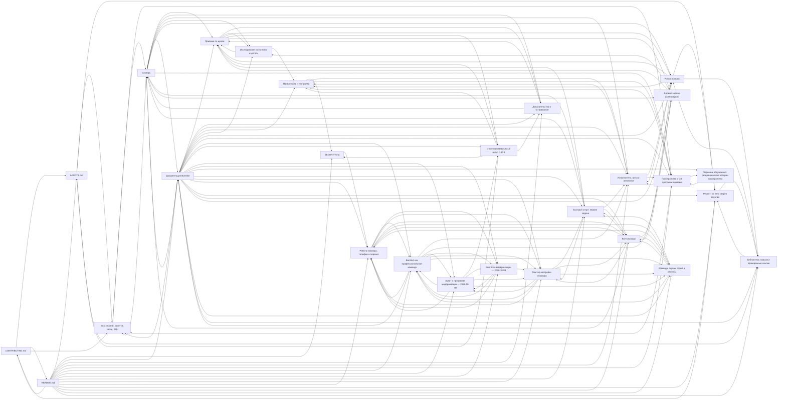

# Граф документации

Эту страницу Borshkit написал сам: собрал свою базу знаний по этому репозиторию и выгрузил её. Команда — `node scripts/docs-graph.mjs`.

Всего в графе: модулей 46, тестов 26, документов 92, связей 1286.

- [`borshkit.sql`](borshkit.sql) — весь граф одним SQL-скриптом. Загрузить: `sqlite3 graph.db < borshkit.sql`, потом спрашивать, например, `SELECT * FROM undocumented_modules;`.
- Ниже — карта документов: стрелка значит «ссылается на». GitHub рисует её сам (Mermaid).

## Документы и код, который они описывают

| Документ | Вид | Описывает код |
|---|---|---|
| [AGENTS.md](../../AGENTS.md) | — | — |
| [CONTRIBUTING.md](../../CONTRIBUTING.md) | — | `scripts/diagrams.mjs` |
| [README.md](../../README.md) | — | — |
| [SECURITY.md](../../SECURITY.md) | — | — |
| [Документация Borshkit](../README.md) | карта | — |
| [Приёмка по целям](../concepts/acceptance.md) | понятие | `core/accept.mjs`, `core/contract.mjs`, `core/eval.mjs`, `core/gitshell.mjs` |
| [Доказательства и устаревание](../concepts/evidence.md) | понятие | `core/accept.mjs`, `core/snapshot.mjs` |
| [Исполнители, пулы и автопилот](../concepts/executors.md) | понятие | `core/adapters.mjs`, `core/dispatch.mjs`, `core/executors.mjs`, `core/jobs.mjs`, `core/questions.mjs` |
| [Словарь](../concepts/glossary.md) | справка | — |
| [База знаний: заметки, связи, SQL](../concepts/knowledge.md) | понятие | `core/kb.mjs` |
| [Приватность и настройки](../concepts/privacy.md) | понятие | `core/config.mjs`, `core/experiment.mjs`, `core/privacy.mjs`, `core/secrets.mjs` |
| [Исследования: источники и цитаты](../concepts/research.md) | понятие | `core/citations.mjs`, `core/materials.mjs` |
| [Роли и навыки](../concepts/roles-and-skills.md) | понятие | `core/roles.mjs` |
| [Пространство и Git простыми словами](../concepts/space.md) | понятие | `core/gitshell.mjs`, `core/hooks.mjs`, `core/space.mjs`, `core/status.mjs` |
| [Borshkit как профессиональная команда](../concepts/team-workspace.md) | понятие | `core/resources.mjs`, `core/team.mjs` |
| [Ответ на независимый аудит 0.10.1](../discussions/audit-2026-10-07.md) | — | `core/accept.mjs`, `core/adapters.mjs`, `core/eval.mjs`, `core/gitshell.mjs`, `core/jobs.mjs`, `core/snapshot.mjs` |
| [Аудит и программа модернизации — 2026-10-08](../discussions/modernization-2026-10-08.md) | справка | — |
| [Контроль модернизации — 2026-10-09](../discussions/modernization-2026-10-09.md) | справка | — |
| [Черновик обсуждения: резервная копия истории пространства](../discussions/space-history-backup.md) | — | — |
| [Быстрый старт: первая задача](../guide/quickstart.md) | руководство | — |
| [Мастер настройки команды](../guide/setup.md) | руководство | `bin/borshkit.mjs`, `core/setup.mjs` |
| [Работа команды, телефон и перенос](../guide/team-operations.md) | руководство | `bin/monitor-worker.mjs`, `core/adapters.mjs`, `core/approval-server.mjs`, `core/approvals.mjs`, `core/assessments.mjs`, `core/integrations.mjs`, `core/monitor.mjs`, `core/operations.mjs`, `core/portable.mjs` |
| [Рецепт: из чего сварен Borshkit](../ingredients.md) | справка | — |
| [Все команды](../reference/commands.md) | справка | `bin/borshkit.mjs` |
| [Формат задачи (contract.json)](../reference/contract.md) | справка | `core/contract.mjs` |
| [Команда, оценки ролей и ресурсы](../reference/team-resources.md) | справка | `core/config.mjs`, `core/executors.mjs`, `core/resources.mjs`, `core/roles.mjs`, `core/team.mjs` |
| [Библиотека: навыки и проверенные ссылки](../../library/README.md) | справка | — |

## Модули ядра без документации

Таких нет.
