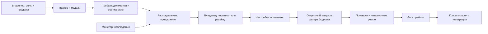

# Работа команды, телефон и перенос

Ветка 0.12.0 содержит инструменты настройки и работы команды. Установленные программы, объявленная подписка и успешная проба подключения не доказывают пригодность модели. Подключение аккаунтов, доступность конкретных моделей и согласие владельца остаются явными шагами.

## Ответственность и цикл поставки

| Обязанность | Роль | Результат и граница |
|---|---|---|
| Цель и решение о выпуске | владелец | контракт, бюджет, ручные критерии; полномочия модели не заменяют согласие |
| Декомпозиция | architect | предложение критериев и проверок |
| Планирование потока | coordinator | зависимости, блокировки, передачи; без применения настроек и слияния |
| Исполнение | implementer, ui-engineer, platform-engineer | файлы в пределах задачи, отдельная копия проекта |
| Задание дизайна | design-prompter | текстовый brief с критериями |
| Визуальный результат | designer и специализированные дизайнеры | изображение или макет, независимая оценка визуального качества |
| Проверка | tester, reviewer, security-reviewer | проверяемые результаты на конкретном состоянии; независимые ревьюеры другого семейства |
| Документация | docs-writer | пользовательские шаги, решения и известные ограничения |

Цикл: цель → контракт → распределение → работа → автоматические проверки → независимое ревью → лист приёмки → консолидация → интеграция → повторная проверка → решение владельца о выпуске. В конце цикла сохраняй checkpoint и урок с привязкой к состоянию. Частичный результат передаётся следующему исполнителю с перечнем файлов, ошибок и неизвестного; семейство предыдущего автора остаётся в учёте независимости.



## Компетенции моделей

Llama может быть кандидатом для brief, Gemini или GPT Image — для изображения, другая подходящая модель — для ТЗ. Название семейства не задаёт рейтинг. Выбирай точный ID модели, поддерживаемый выход, политику данных, актуальную пробу и оценку конкретной роли. Оценка не переносится на другую конфигурацию, инструкцию или набор навыков.

```sh
borshkit стенд запустить <исполнитель> --файл examples/assessment-brief.json --вход-токены 5000 --выход-токены 1500
borshkit стенд предложить --файл <путь-к-отчёту.json>
borshkit настройки применить <предложение>
borshkit команда план <задача> --вход-токены 5000 --выход-токены 1500
```

Стенд запускается явно и может расходовать платные ресурсы. Каждый случай получает только явные fixtures в временной папке, действующие инструкции и навыки роли. Проверки не передаются в промпт. Команды проверок выбирает владелец набора; они исполняются локально и требуют доверия. Результат PASS требует успеха схемы и всех независимых команд. Для image-роли нужен `imagePath` внутри случая и проверка PNG; структурная проверка изображения не оценивает красоту, соответствие бренду или UX. Эти свойства проверяются отдельным визуальным ревью и ручными критериями.

Отчёт фиксирует модель, конфигурацию, SHA набора и инструкций, случай, расход и среду. Предложение оценки отдельно применяется. Результаты локальных поддельных исполнителей проверяют механизмы, а не качество реальных моделей. Изменение исполняемых внешних проверочных программ требует нового набора и оценки; для воспроизводимого стенда помещай проверку в аргументы команды или закрепляй её версию отдельно.

## WIP, бюджет и стоимость

```sh
borshkit бюджет предложить --файл examples/execution-policy.json
borshkit настройки применить <предложение>
borshkit работа запустить <задача> --роль implementer --исполнитель <имя> --вход-токены 5000 --выход-токены 1500
borshkit бюджет показать
```

`execution.maxActiveRuns` и `maxActiveTasks` ограничивают одновременно выполняемые вызовы и задачи. Резервы jobs и стенда создаются под общей блокировкой `.state/execution-ledger.json`. Бюджеты `tokenBudget` и `usdBudget` — совокупные для этого журнала, не суточные квоты аккаунта. Резерв требует оценки; денежный резерв также требует актуального тарифа с `source`, `at`, `expiresAt` и fingerprint исполнителя. Изменение тарифов и повышение пределов подтверждает владелец.

Тариф: `execution.rates.<executor> = {inputUsdPerMillion, outputUsdPerMillion, fingerprint, source, at, expiresAt}`. Цены вводятся по проверенному источнику. План сортирует по оценке цены только модели с актуальными тарифами и положительными оценками на одном SHA набора. В остальных случаях он объясняет доступность без выдуманного сравнения стоимости. Семейство ревьюера резервируется отдельно.

API получает ограничение выходных токенов. Оценка входа может оказаться ниже фактического расхода; CLI, retries и провайдер могут расходовать больше оценки. Это механизм ограничения запусков и учёта, не банковский лимит и не гарантия максимального счёта. Жёсткие ограничения расходов устанавливай у провайдера. После исчерпания бюджета новые бюджетные вызовы блокируются.

Если расход не измерен, запись становится UNKNOWN, резерв сохраняется. После обрыва процесса восстановление также даёт UNKNOWN. Подписочные балансы Claude/Codex/Gemini, которые среда не раскрывает, не угадываются. HTTP-остатки имеют срок и область endpoint/account; `/models` не означает остаток генерации.

```sh
borshkit бюджет восстановить
borshkit бюджет сверить <id-резерва> --файл расход.json
```

Сверка `{tokens, usd, source}` требует подтверждения владельца в терминале и остаётся заявленной сверкой, не проверенным счётом. Passkey в этой версии подтверждает настройки и критические вопросы; сверка бюджета, слияние и отправка Git через него не выполняются.

## Зависимости и консолидация

В `contract.json` укажи `dependencies: ["upstream-task"]`. Перед новым запуском все зависимости должны быть приняты на текущем состоянии. Для зависимости с worktree результат должен быть интегрирован в HEAD проекта или существующей копии текущей задачи. Циклы зависимостей блокируются.

```sh
borshkit координация зависимости <задача>
borshkit координация итог <задача-1> <задача-2>
```

Checkpoint хранит статусы, зависимости и точные состояния в `coordination/checkpoint-*.json` и человекочитаемом Markdown. READY_FOR_INTEGRATION — снимок, не слияние или общий PASS проекта. После интеграции выполни общие проверки. Координатор предлагает порядок; ядро и владелец выполняют решения.

## Подтверждение с телефона

Сервис запускает владелец явно. Для телефона нужен доверенный HTTPS origin с доменным именем. Локальная разработка допускает HTTP localhost. `--trusted-proxy` означает, что доверенный TLS proxy уже настроен с сохранением Host; Borshkit сам его не разворачивает.

```sh
borshkit подтверждение serve --origin https://approval.example.org --trusted-proxy
# либо собственный HTTPS:
borshkit подтверждение serve --origin https://approval.example.org:8787 --cert сертификат.pem --key приватный-ключ.pem
```

По умолчанию сервис слушает только `127.0.0.1:8787`. Открой выбранный origin в браузере телефона, нажми «Создать публичный файл устройства». Передай этот публичный файл доверенному администратору и независимо сверь origin и файл. Администратор регистрирует его вне агентской сессии:

```sh
borshkit подтверждение enroll phone --file borshkit-device.json
borshkit подтверждение devices
borshkit подтверждение revoke phone
```

Первое сопряжение и отзыв требуют владельца в терминале. Полностью дистанционный старт без уже доверенного канала не решается самим JSON-файлом или голосовым сообщением. После сопряжения выбери предложение/критический вопрос на странице, прочитай действительные настройки до/после и ослабления, затем подтверди passkey с проверкой личности устройства. Настройки применяются отдельно от запуска работы. Вопрос получает конкретный выбранный ответ.

Приватный ключ остаётся в аутентификаторе. Реестр устройств, nonce и аудит лежат **вне проекта**, по умолчанию `~/.config/borshkit/approvals`; `--store` выбирается доверенным владельцем. Срок 120 секунд, максимум пять минут. Проверяются ES256/P-256, credential ID, RP, точный origin, challenge, присутствие и проверка личности, срок, отзыв, проект, версия действия и одноразовость. Повторное использование и изменение предложения требуют нового согласия; если применение сорвалось после потребления nonce, повторная попытка тоже требует нового согласия.

Это защита протокола для агента с доступом к проекту, а не от администратора ОС или агента с доступом к реестру и коду сервиса. Размести сервис и реестр под отдельной учётной записью/изолированным хостом, если агент может писать за пределами проекта. Терминальная фраза сама по себе остаётся барьером UX, не доказательством идентичности. Браузерный сценарий с реальным passkey и собственным HTTPS должен быть проверен владельцем; криптографические fixture-тесты не заменяют такую проверку.

## Управляемый монитор

```sh
borshkit монитор once
borshkit монитор start --task <задача> --roles architect,implementer,reviewer --suggest --interval 30000 --cycles 120
borshkit монитор status
borshkit монитор stop
```

`start` запускает отдельный процесс, `run` — в текущем терминале. Один монитор держит lock с PID, сохраняет владельца-token, heartbeat, последний отчёт и ограничение циклов. `stop` пишет запрос этому token; чужой PID не завершается. Остановка подтверждается после текущего цикла/паузы. При аварийном завершении состояние INTERRUPTED; явный новый запуск восстанавливает зависшие резервы как UNKNOWN.

Монитор обновляет TEAM.md и STATUS.md из локальных наблюдений; генерацию и API-пробы не выполняет. С `--suggest` он предлагает новое распределение только при изменении данных и доступном составе; защита от повторных одинаковых предложений действует внутри одного запуска. Предложение не применяется. Нет скрытого старта на init, включения автопилота или автоматического продолжения jobs.

## Среды и входные материалы

| Среда | Реализованный канал | Ограничение |
|---|---|---|
| Codex CLI | нативный adapter, schema, sandbox, события | версия/флаги проверяются; права и подписка среды отдельны |
| Claude Code CLI | нативный adapter, schema, ограниченные инструменты | версия/флаги проверяются; Remote Control обеспечивает установленная среда |
| Gemini CLI | headless stream-json, явная модель, sandbox, deny-all policy, extensions none | инструментов нет; scoped текст передаёт Borshkit; admin policies блокируют запуск; точный ID модели обязателен |
| Gemini API | generateContent, JSON и PNG, usageMetadata | ключ по имени переменной, доступ модели и политика аккаунта проверяются отдельно |
| OpenAI compatible API | JSON и images/generations | совместимость конкретного endpoint проверяется отдельно |
| VS Code | локальное расширение с setup/status/team через Node ProcessExecution | требуется Node 22+, Git и доверенный workspace; не устанавливает чужие плагины |
| Copilot, Roo, Cline | экспорт инструкций в формат среды | не заявлены нативные executor adapters, совместимые hooks или Remote Control |
| Приложения Codex/Claude и телефон | вызов CLI через доступную среду; passkey-страница | телефон управляет хостом исполнения, не обязан локально запускать Node |

Gemini не использует YOLO; профиль исключает инструменты и проверяет init-модель. Политики уровня проекта у Gemini upstream сейчас не действуют; Borshkit передаёт явный deny-all policy и отказывается при наличии стандартных admin TOML. Это всё равно не изоляция от владельца ОС, нестандартных глобальных настроек или уязвимой версии CLI. Проверка качества роли должна проводиться на конкретной установленной версии. API-профиль не отправляет `tools` и не исполняет function calls.

```sh
borshkit integration export --host codex
# допустимые host: claude, gemini, copilot, roo, cline
node scripts/vsix.mjs /tmp/borshkit.vsix
code --install-extension /tmp/borshkit.vsix
```

Экспорт не перезаписывает пользовательский файл или изменённый вручную ранее управляемый файл. В таком случае добавь ссылку на SETUP/TEAM/STATUS вручную. Расширение содержит runtime пакета; команды вызывают Node с отдельными аргументами, без конкатенации shell-команды. Голос транскрибирует хост; полученный текст — вход задачи без дополнительных полномочий. Материалы, цитаты и изображения подключаются явно через существующие material/task-механизмы; источник, SHA и границы приватности сохраняются.

## Перенос и происхождение

```sh
borshkit portable export --file файлы.json --out набор.json
# файлы.json: ["src/app.js", "package.json", "README.md"]
# на новом хосте в отдельном проекте с Git и созданным пространством:
borshkit portable import --file набор.json
```

Набор до 32 MiB: явные обычные файлы, SHA-256 каждого и всего payload, режим файла, commit источника, версия и сведения среды, шаблон настроек. Скрытые папки, пространство Borshkit, ключи и symlink не экспортируются; распознанные секреты блокируются. Импорт проверяет целостность и отказывается перезаписывать файл. SHA выявляет изменение, но не доказывает доверие автору. Импортируй набор из доверенного источника.

Импорт даёт IMPORTED_UNVERIFIED и отдельное предложение настроек, если они отличаются. `autopilot`, trustedAgent, принятие задач, процессы, устройства, абсолютные worktree-пути, тарифы, пробы и квалификации не переносятся. Это перенос источников, а не восстановление активной сессии или всех секретов/материалов/истории пространства. Повторное принятие результатов требует новых свидетельств. Вывод LLM не обещается идентичным при повторном запуске.

`Dockerfile` и Dev Container фиксируют Node 22.14.0 и Linux-среду; образ по version tag не является неизменяемым digest и сам по себе не доказывает битовую воспроизводимость. Сборку контейнера и поддержку твоего CPU проверяй отдельно. CLI поддерживает Node 22+ и Git на Linux/Windows/macOS; факт прохождения каждого OS подтверждает CI именно нужного commit.

Релизный workflow проверяет package/plugin/VS Code/tag, запускает verify, собирает tgz и VSIX, SHA256SUMS и build-provenance.json, затем создаёт GitHub OIDC attestation. Локальный manifest — не подписанная attestation. Подписанное происхождение считается доступным только после успешного выполнения workflow:

```sh
gh attestation verify borshkit.tgz --repo ParkPavel/borshkit
```

## Связи

- [Мастер настройки](setup.md)
- [Архитектура команды](../concepts/team-workspace.md)
- [Команды и форматы](../reference/team-resources.md)
- [Контроль завершения](../discussions/modernization-2026-10-09.md)
